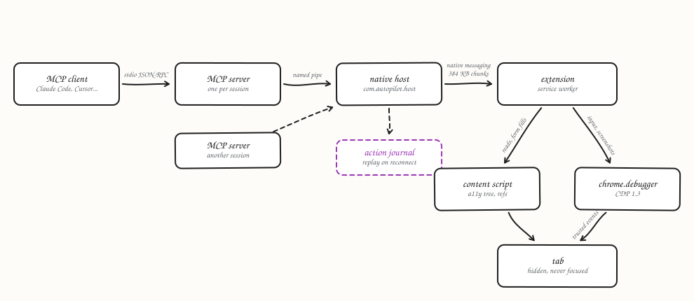

# Autopilot

[](https://github.com/emerson-d-lopes/autopilot/actions/workflows/ci.yml) [](https://github.com/emerson-d-lopes/autopilot/actions/workflows/live.yml) [](https://github.com/emerson-d-lopes/autopilot/actions/workflows/codeql.yml) [](LICENSE)

An MCP server that drives your real Chrome through a Manifest V3 extension and the DevTools Protocol. It works in the background, in its own tab group, and its popup shows what it is doing. Built to match the capability set documented in [SPEC.md](SPEC.md).

It works against the browser you are already signed into, so it can act on Gmail, Notion, an internal dashboard, or a localhost dev server without any API credentials.

## What it does

- Reads pages as an accessibility tree with stable `ref_N` handles, which is cheaper and more reliable than screenshots
- Clicks, types, hovers, scrolls, and drags through CDP, so events arrive with `isTrusted` set
- Fills form controls in one call, including selects, checkboxes, and React-managed inputs
- Captures screenshots downscaled to a fixed token budget, with coordinates that map back correctly on any display scaling
- Reads network requests captured from the moment the tab joined the session, and console output from the first read onward, which keeps the domain a CDP detector watches off tabs that never ask for it
- Runs several actions in one round trip with `browser_batch`, or a whole compact script with `quick`
- Attaches local files to file inputs and to drag-and-drop upload zones
- Draws a pointer on the page so you can watch what it is doing
- Works in the background: its tabs open unselected in your current window, nothing is ever brought to the front, and the group is marked ⏳ while a call runs, ✅ when it finished, ❌ when it failed. You look at its tabs when you choose to

## Requirements

- Node 20 or newer
- A Chromium browser. Chrome, Edge, Brave, and Vivaldi are registered automatically.

## Install

```bash
git clone https://github.com/emerson-d-lopes/autopilot.git
cd autopilot
npm install
npm run install-host    # registers the native messaging host for Chrome, Edge, Brave, Vivaldi
```

Then load the extension:

1. Open `chrome://extensions`
2. Turn on **Developer mode**
3. Click **Load unpacked** and select the `extension` folder in this repo
4. Restart Chrome so it picks up the native messaging host registration

Chrome 137 and later ignore the `--load-extension` command line flag, so this step cannot be scripted against a stock Chrome install. It is a one-time click-through. The extension id is `giagijohigincdlpkfolgcljkhmjdiaa` on every machine, because the manifest carries the public key, and the host registration is written for that id. `npm run keygen` exists only to re-key the extension with an identity of your own; it rewrites the manifest key and the host registration together.

Then point your MCP client at the server. It speaks MCP over stdio, so any client that can run a command works. The command is `node` and the one argument is the absolute path to `host/mcp-server.js` in this repo. Examples, with `<repo>` standing for that path:

**Claude Code**

```bash
claude mcp add autopilot -- node "<repo>/host/mcp-server.js"
```

**Claude Desktop**: `claude_desktop_config.json` (macOS: `~/Library/Application Support/Claude/`, Windows: `%APPDATA%\Claude\`)

```json
{ "mcpServers": { "autopilot": { "command": "node", "args": ["<repo>/host/mcp-server.js"] } } }
```

**Cursor**: `.cursor/mcp.json` in the project or `~/.cursor/mcp.json`, same `mcpServers` shape as above.

**VS Code (Copilot agent mode)**: `.vscode/mcp.json`

```json
{ "servers": { "autopilot": { "type": "stdio", "command": "node", "args": ["<repo>/host/mcp-server.js"] } } }
```

**OpenCode**: `opencode.json`

```json
{ "mcp": { "autopilot": { "type": "local", "command": ["node", "<repo>/host/mcp-server.js"], "enabled": true } } }
```

**Codex CLI**: `~/.codex/config.toml`

```toml
[mcp_servers.autopilot]
command = "node"
args = ["<repo>/host/mcp-server.js"]
```

**Gemini CLI**: `~/.gemini/settings.json`, an `mcpServers` entry with the same `command` and `args`.

**Windsurf, Zed, pi, and others**: every one of them takes a stdio server as a command plus arguments. Use `node` and the path above. If a client asks for a single command line, `node "<repo>/host/mcp-server.js"` is it.

On Windows, give the path with forward slashes or doubled backslashes inside JSON. The server finds the browser through a registry directory the native host writes, so no port or URL is configured anywhere. With one browser connected it is used automatically; with several, the session calls `select_browser`.

Two environment variables are read by the server: `AUTOPILOT_BROWSER_ID` pins a browser for the session, and `AUTOPILOT_LOG_DIR` moves the action journal. The project was called chrome-mcp until 0.2.0, so the matching `CHROME_MCP_*` names are still read for one release and the host logs a line when it uses one.

Check everything at once:

```bash
npm run doctor
```

It also prints where the action journal lives, and `npm run log` shows today's journal. It verifies the key, the host manifest, the node path baked into the wrapper, the per-browser registration, the bridge socket, and whether the extension is attached. It names the first broken link and what to run.

### Handing the install to an agent

The same steps, written as a prompt for an agent on a fresh machine. It is also kept at [docs/INSTALL-HANDOFF.md](docs/INSTALL-HANDOFF.md).

````text
Install and connect the Autopilot MCP server on this machine. Autopilot drives the user's own Chrome through an unpacked Manifest V3 extension and the Chrome DevTools Protocol, in the background, so the user's existing logins are usable and nothing ever brings a tab or window forward. Repository: https://github.com/emerson-d-lopes/autopilot (branch `main`, extension 0.2.0, npm package `autopilot-chrome`, MCP server name `autopilot`, native messaging host `com.autopilot.host`).

Do these steps in order and stop at the first failure, quoting the output.

1. Clone or update the repository to `C:\Users\<user>\workspace\autopilot` (any path works, but every later step uses the path you chose). Run `npm install` there. Node 20 or newer is required, and on this machine Node is managed by fnm, so run the commands from a shell where `node --version` answers.

2. Register the native messaging host: `npm run install-host`. It writes `host\com.autopilot.host.json`, rewrites `host\native-host.bat` with the real path to the node binary, registers the host with Chrome and Edge (and Brave and Vivaldi when installed), and removes any old `com.chromemcp.host` registration from an earlier name of this project. Read its output. Do not run `npm run keygen`: the extension key is committed and pins the id `giagijohigincdlpkfolgcljkhmjdiaa`, which the host registration expects.

3. Load the extension. Chrome 137 and later ignore `--load-extension`, so this is a manual step for the user: open `chrome://extensions`, turn on Developer mode, click Load unpacked, choose `<repo>\extension`. It must appear as "Autopilot" with version 0.2.0. If an older entry pointing at a `chrome-mcp` path exists, remove it first. Then fully restart Chrome so it reads the host registration.

4. Add the server to Claude Code at user scope: `claude mcp add -s user autopilot -- node "<repo>\host\mcp-server.js"`. For another MCP client, the equivalent stdio entry is `{"command": "node", "args": ["<repo>/host/mcp-server.js"]}`. Tools then appear as `mcp__autopilot__<tool>`.

5. Verify with `npm run doctor`. Every line must read `ok`, including "a browser is connected" and "Chrome extension is attached" with `extension v0.2.0`, and the profile line must show the Chrome profile name, the signed-in account and the sites with a session. If doctor says no browser is connected, Chrome was not restarted after step 2 or the extension is not loaded. If it says the extension is attached but names an older version, the reload did not take.

6. Make one real call without a chat session, through the bundled client: `node tools\mcp-client.js list_connected_browsers '{}'`. It must print the browser, profile, account and sessions. Then in Claude Code run `/mcp`, connect `autopilot`, and call `mcp__autopilot__tabs_context` with `createIfEmpty: true`, which opens an unselected tab in the user's current window.

Facts the user will want stated back:

- Background mode is a design rule. Tabs open unselected, nothing is activated or focused. Hidden tabs are woken through CDP and captured through a screencast frame.
- With several Chrome profiles open, each connects as its own browser. `select_browser` takes `browserId`, `label`, `profile`, `account` or `site` (for example `{"site": "linkedin.com"}` picks the profile signed in there), and every page tool accepts an optional `browser` argument for one call. `AUTOPILOT_BROWSER` in the server environment sets the session default.
- Permission modes live on the extension's options page: allow (default, with a financial-site blocklist), ask per origin, confirm (an irreversible click such as Send, Post, Delete or Pay returns a token and a screenshot of what is about to be submitted, and only the tokened retry performs it), and plan (`declare_plan` once per session). The optional in-browser Allow/Deny toast is off by default.
- Every result carries `ok`, `effects` (none, applied, unknown), `evidence` and `warnings`, and every error carries a code from `host/errors.js`, a cause, a hint and whether it is retryable. An action journal is written under `%TEMP%\autopilot-logs` and read with `npm run log`. Set `AUTOPILOT_JOURNAL_REDACT=1` to keep typed values out of it.
- A site probing for CDP automation can detect the session. The debugger banner is visible on driven tabs.

Documentation in the repository: README.md (usage and tools), STATUS.md (state, bugs, verification history), HANDOFF.md (working rules), docs/claude-in-chrome-comparison/RESULT.md (the measured comparison against Claude in Chrome and the scorecard).
````

## Tools

| Tool | Purpose |
|---|---|
| `tabs_context` | List the tabs this session owns. Call it first. `createIfEmpty` opens a blank tab in the current window |
| `tabs_create` / `tabs_close` | Open and close tabs in the session group |
| `navigate` | Go to a URL, or back and forward |
| `read_page` | Accessibility tree with `ref_N` handles, `interactive` filter, depth and subtree control |
| `get_page_text` | Readable text, article content first |
| `find` | Ranked element lookup from a description |
| `form_input` | Set a form control by ref |
| `computer` | Click, hover, type, key, scroll, drag, screenshot, zoom, scroll_to |
| `javascript` | Evaluate an expression in the page |
| `read_console_messages` | Console output with regex and error filters |
| `read_network_requests` | Requests with status, size, and failure filters |
| `page_state` | URL, title, scroll position, viewport |
| `wait_for_page` | Wait for load and for the DOM to stop mutating |
| `resize_window` | Resize the window holding a tab |
| `file_upload` | Attach local files to a file input or a drop zone |
| `upload_image` | Attach a screenshot by the id printed under it, an image by path, or the last screenshot |
| `gif_creator` | Record a flow as an animated GIF |
| `list_connected_browsers` | List the browsers running the extension |
| `select_browser` / `switch_browser` | Choose which browser this session drives |
| `shortcuts_list` / `shortcuts_execute` | Saved quick scripts, edited from the options page |
| `browser_batch` | Run a sequence of tool calls in one round trip |
| `quick` | Run a compact one-line-per-action script in one round trip |

Tool names and argument spellings from Claude in Chrome (`tabs_create_mcp`, `javascript_tool`, `onlyErrors`, `urlPattern`, `deviceId`, the gif action names) are accepted as well, at the top level and inside `browser_batch`, so a batch written for that extension runs unchanged.

## The extension

Autopilot shows up as a monochrome mark in the toolbar. Its popup shows the connection state, the sessions this browser holds with their status marks, and the last few calls. Clicking a session reveals its tabs, which is the one way an Autopilot tab is ever brought to the front. The settings page holds the permission mode, blocked and allowed hosts, saved shortcuts, and granted sites.

Both pages are built on the Ash Lumen design system (`extension/src/ui/tokens.css` and `components.css`, copied from the `ash-lumen` package) with a small layout and motion file of their own. The icon is `extension/src/ui/icon.svg`, rendered to the PNG sizes Chrome needs by `npm run icons` through the development browser.

## Permissions

Two layers guard a call. The MCP client prompts per tool call on its side. The extension enforces the part a client cannot bypass:

- An origin blocklist covering financial and payment sites, applied to reading as well as acting
- Three modes: allow with blocklist (default), require a grant per origin, or skip grant checks
- A re-check before every mutating action that the tab is still on the origin the call was authorized against, which closes the window where a page navigates between the decision to click and the click landing

Manage it from the extension's options page (`chrome://extensions` then **Details** then **Extension options**).

## Quick mode

`browser_batch` collapses several calls into one round trip but still spends a nested JSON object per action. `quick` expresses the same sequence as one line each:

```
F ref_12 buyer@example.com
F ref_15 Portugal
C ref_18
W
R
```

Commands: `C` `RC` `DC` `TC` click, `H` hover, `SC` scroll into view, `T` type, `TK` type with real key events, `K` keys, `F` set a form control, `S` scroll, `D` drag, `N` navigate, `J` evaluate, `W` wait to settle, `R` read page, `X` page text, `SS` screenshot, `P` page state, `Z` zoom, `NT` new tab (later lines act on it), `ST` switch tab, `LT` list tabs, `#` comment. Targets are a ref or an `x y` pair.

The whole script is parsed before anything runs, so a typo on the last line cannot leave the page half way through a sequence. Execution stops at the first failing line and names it.

## The pointer

The agent draws a pointer where it is acting, with a warm halo so it is findable on a busy page, and a press state and ripple on click. It travels to a target before clicking and follows drags step by step, so the order you see matches the order the page receives.

It is presentation only. Input is dispatched through CDP and is byte for byte identical whether or not the pointer is drawn, so it makes no difference to how a site sees the automation. It lives in a closed shadow root with `pointer-events: none`, is excluded from the accessibility tree, and is hidden before every screenshot so the model never mistakes its own cursor for page content.

## Action journal

Every call is recorded by the native host, which sees each request and its response. Two files per browser per day under `%TEMP%\autopilot-logs\<browser id>\` (or `AUTOPILOT_LOG_DIR`): `<date>.jsonl` with one object per call, and `<date>.md`, a timeline a person can read:

```
- 05:48:14 **navigate** tab 12 https://httpbin.org/forms/post `url="https://httpbin.org/forms/post"` (505ms) url=https://httpbin.org/forms/post
- 05:48:15 **form_input** tab 12 https://httpbin.org/forms/post `ref="ref_1" value="Test Person"` (8ms)
- 05:48:16 **computer** tab 12 https://httpbin.org/post `action="left_click" ref="ref_13"` (610ms)
```

Each entry has the time, the tool, the tab and the page it was on after the call, the arguments with bulk removed (no image data, long strings clipped), the duration, and either a short account of the result or the error. `npm run log` prints today's timeline, `npm run log -- --tail 20` the last twenty calls, `--json` the raw entries, `--date 2026-09-03` another day. The journal never blocks a call: a write failure is dropped.

The host's own lifecycle log (connections, disconnections, transport errors) is separate, at `%TEMP%\autopilot-host.log`.

## Several browsers

Each connected browser gets its own native host, its own pipe, and an entry in a registry directory. With one browser connected it is used automatically. With several, a session calls `select_browser` once and the choice holds. `npm run doctor` lists what is connected.

## Architecture

<picture>
  <source media="(prefers-color-scheme: dark)" srcset="docs/architecture-dark.svg">
  
</picture>

*how does a tool call from an MCP client reach a hidden tab in the user's own Chrome?* reads go through the content script in a few milliseconds. input and capture go through chrome.debugger so the page sees trusted events. the tab is opened unselected and woken with focus emulation, which is why nothing on screen moves while an agent works.

```
Claude Code ──stdio──> mcp-server.js ──named pipe──> native-host.js ──native messaging──> extension ──CDP──> page
```

The native host is the listener and MCP servers are clients, so several Claude Code sessions share one browser connection instead of competing to bind the same pipe. Payloads above 384KB are chunked, because Chrome caps a single native message at 1MB and screenshots exceed it.

`tools/install.js` resolves the real path to the node binary with `realpath` before writing the wrapper. Chrome spawns the host from the browser process rather than a shell, and fnm's `process.execPath` points into a per-shell directory that disappears when the terminal closes.

## Five constraints that shape the implementation

**A pending `setTimeout` does not keep an MV3 service worker alive.** Chrome suspends the worker while it awaits one, so a 100ms hover delay measured about five seconds in practice and every click paid it. Timed waits run on the page's clock through `Runtime.evaluate`, which keeps the worker busy on a pending extension API callback.

**A hidden tab has its renderer throttled, and the agent works in hidden tabs.** Chrome holds input acknowledgements, stops animation frames and reports the page hidden. Two CDP calls on attach undo that from the page's point of view: focus emulation and an active web lifecycle state. Measured on Chrome 152, a hidden tab then answers a mouse event in a millisecond, runs `requestAnimationFrame`, keeps timers accurate and reports itself visible and focused, minimized window included. Captures are the exception: a surface screenshot of a hidden tab takes seconds or never returns, and the extension debugger API refuses renderer captures, so a hidden tab is captured through a single screencast frame, in about 50ms.

**Capping the long edge is not enough for screenshots.** A tall viewport stays under 1568px wide and still costs about 2800 tokens. Captures are bounded by area as well, to roughly 1600 tokens whatever shape the window is.

**A fully covered window is reported as hidden, and its renderer stops accepting input.** Chrome's native window occlusion detection sets `visibilityState` to `hidden` when another window completely covers Chrome. The same focus emulation and lifecycle state that make a hidden tab work make a covered or minimized window work. `npm run browser` still launches with `--disable-features=CalculateNativeWinOcclusion` so tests do not depend on which window happens to be in front.

**Input acknowledgements are bounded.** `Input.dispatchMouseEvent` answers only once the renderer has processed the event, and a throttled renderer holds that answer for a fixed five seconds. Dispatch waits briefly and moves on, since the event is delivered either way, and records that the renderer looked throttled so the next action can correct it.

## Development

```bash
npm run check         # what CI runs: lint, format, version sync, unit suite with coverage
npm test              # everything, about two minutes with a browser up
npm run test:unit     # the unit suite with browser discovery off, the CI command
npm run browser       # isolated browser with the extension loaded
npm run test:live     # browser tests only
npm run test:resilience   # the slow recovery tests on their own
```

[CONTRIBUTING.md](CONTRIBUTING.md) has the full script list, the rules CI enforces (a version bump on every change under `extension/`, `host/errors.js` as the canonical error table, coverage thresholds in `tools/run-tests.js`), and how to write a test. Every pull request runs lint, Prettier, the unit suite on Node 20, 22 and 24 with coverage thresholds, CodeQL, and, when the extension or host changed, the live suite on Chrome for Testing.

Live tests skip themselves when no bridge is listening, so `npm test` stays useful without a browser. With several browsers connected they prefer the one `npm run browser` started, which it records in `.browsers/dev-browser-id`. Start that browser from a terminal that stays open: launched from a shell that exits, it goes with it.

`npm run browser` uses Chrome for Testing, which still honours `--load-extension`, against its own profile. Install it once:

```bash
npx @puppeteer/browsers install chrome@stable --path .browsers
```

**After editing extension code, reload the extension.** Chrome keeps a compiled module graph for extension service workers and reuses it across browser restarts, so a cold start can still run stale code. On Chrome 152 it lives in `Default/Extension Scripts` in the profile. `npm run browser` deletes that cache on launch. In your own Chrome, press the reload button on the extension card at `chrome://extensions`.

The suite covers the accessibility tree against a real DOM, the ranking in `find`, screenshot maths, the permission model, native messaging framing including chunk reassembly, IPC, schema and handler parity, the MCP protocol across real processes, and a live pass over a fixture page that exercises every tool against a running browser, including right and double clicks, pointer drags, HTML5 drag and drop, per-key typing, file uploads, and quick scripts.

The recovery suite proves the parts that only fail over time: a session survives the service worker going idle past its 30 second timeout, it recovers when the native host is killed underneath it, a restarted client can resume a session by id, and a request that is in flight when the bridge dies reports an error rather than hanging.

## Status

[STATUS.md](STATUS.md) has the full picture: parity against Claude Code tool by tool, what is and is not tested, the bugs found during the build, and the browser behaviours that shape the implementation. [COMPARISON.md](COMPARISON.md) sets the project against Claude in Chrome, Playwright MCP, Chrome DevTools MCP and Browser MCP, feature by feature and with measured call latencies.

## Known limits

- Loading the extension is manual on Chrome 137 and later
- Cross-origin iframes are reported as leaves, since reading inside one needs a frame-targeted call
- A JavaScript modal dialog blocks all further extension calls until a human dismisses it, which is a Chrome constraint
- The CDP debugger banner is visible on tabs the session has attached
- A site probing for CDP automation can detect the session. `deviceandbrowserinfo.com/are_you_a_bot` returned `isBot: true` on all three runs of the 0.1.7 comparison campaign, with `isAutomatedWithCDP: true` as the only flag set: webdriver, Selenium, Playwright and headless markers all read `false`, and the canvas, WebGL, plugin and user-agent fingerprints matched an unautomated Chrome exactly. Driving the browser through the DevTools protocol is what the project does, so this is a true positive rather than a fixable leak. From 0.1.13 console capture is off until a tool asks for it, which keeps `Runtime.enable` off tabs that never read the console and reduces the surface without removing it. `browserscan.net/bot-detection`, whose own CDP section is named for this check, reported Normal on the same build
- Completely covering the Chrome window can stall input until the extension raises it again, because Chrome stops the renderer of an occluded window
